# 搭建微信公众号机器人(对接RASA聊天机器人服务)

参考[开启微信公众号开发者模式](https://developers.weixin.qq.com/doc/offiaccount/Getting_Started/Getting_Started_Guide.html)

公网IP采用内网穿透的方式参考[NatAPP](https://natapp.cn/) 

（可以使用免费隧道也可以10块钱一个月购买VIP隧道）

[RASA 聊天机器人项目参考](https://github.com/Dustyposa/rasa_ch_faq)

## 1.基于内网穿透的方式使用本地服务器可以映射出公网IP

在NatAPP上选择购买一款隧道，有免费的隧道可供使用

按照上面的教程，下载客户端软件，记住购买后的隧道Token值，

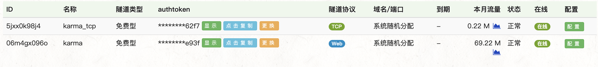进入到下载的natapp脚本目录启动服务

```
./natapp -authtoken=XXXXXX
```

启动成功便得到以下结果

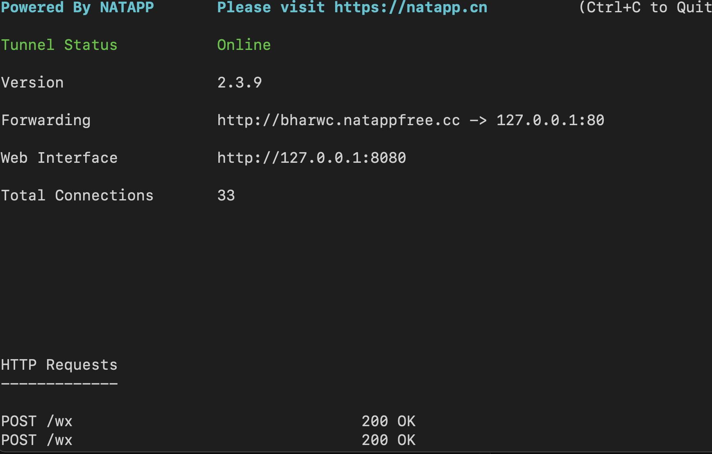

Forwarding后面的IP地址便是映射的公网IP，映射的端口根据对隧道的具体配置，可以自由修改

## 2.开启公众号开发者模式

### 2.1搭建服务

- python3.7

- web.py

  - ```bash
    pip install web.py
    ```

```bash
vim main.py
```

```python
# -*- coding: utf-8 -*-
# filename: main.py
import web

urls = (
    '/wx', 'Handle',
)

class Handle(object):
    def GET(self):
        return "hello, this is handle view"

if __name__ == '__main__':
    app = web.application(urls, globals())
    app.run()
```

之后直接终端执行 **python main.py**. 默认端口号位80 启动服务后终端出现如下结果

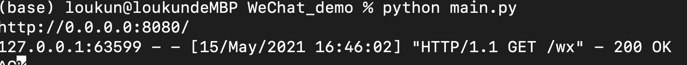

打开浏览器，输入本地IP地址加端口号或者实现了内网穿透的话直接打开映射的外网IP会显示 "hello, this is handle view" 到此服务配置成功

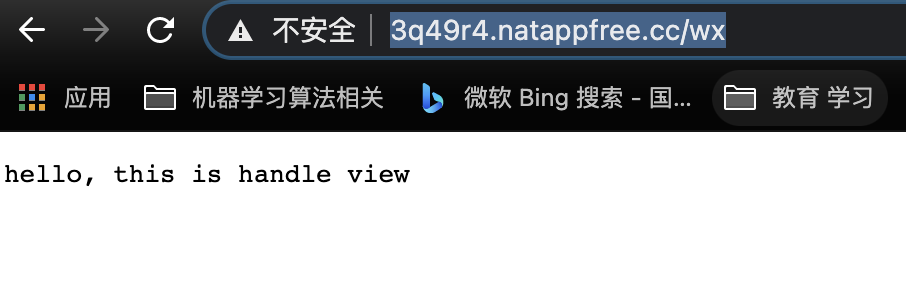

### 2.2注册公众号

略

### 2.3开发者基本配置

1） 公众平台官网登录之后，找到“基本配置”菜单栏

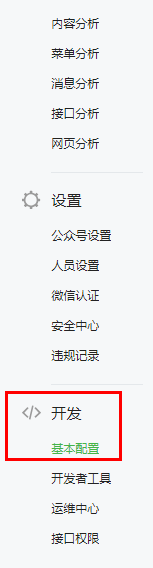

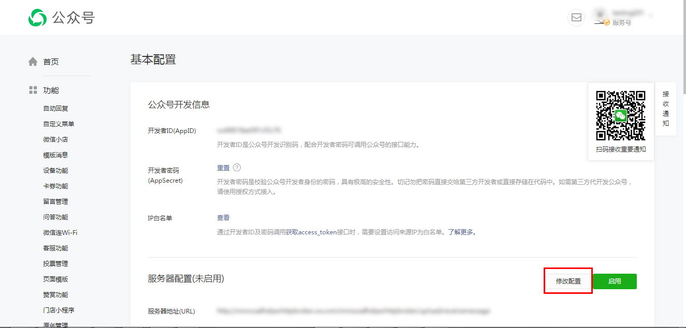

2） 填写配置 url填写：http://[外网IP]/wx 。外网IP设置为第一步配置的内网穿透后的IP地址。 http的端口号固定使用80，不可填写其他。 Token：自主设置，这个token与公众平台wiki中常提的access_token不是一回事。这个token只用于验证开发者服务器。

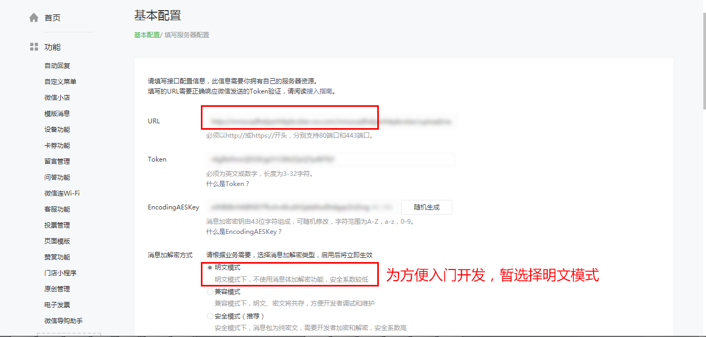

3） 现在选择提交肯定是验证token失败，因为还需要完成代码逻辑。新增handle.py，改动原先main.py文件

```bash
vim handle.py
```

```python
# -*- coding: utf-8 -*-
# filename: handle.py

import hashlib
import web

class Handle(object):
    def GET(self):
        try:
            data = web.input()
            print(data)
            if len(data) == 0:
                return "hello, this is handle view"
            signature = data.signature
            timestamp = data.timestamp
            nonce = data.nonce
            echostr = data.echostr
            token = "XXXX" #请按照公众平台官网\基本配置中信息填写

            li = [token, timestamp, nonce]
            li.sort()
            # 需要将加密的数据编码成utf-8的，不然会出错，Token验证失败
            tmp_str = "".join(li).encode('utf-8')
            #进行sha1加密
            hashcode = hashlib.sha1(tmp_str).hexdigest()

            #sha1 = hashlib.sha1()
            #map(sha1.update, li)
            #hashcode = sha1.hexdigest()
            print("handle/GET func: hashcode, signature: ", hashcode, signature)
            if hashcode == signature:
                return echostr
            else:
                return ""
        except Exception as Argument:
            return Argument
```

在main.py中导入改包

```python
from handle import Handle
```

重新启动成功后（python main.py 80），点击提交按钮。若提示”token验证失败”, 请认真检查代码或网络链接等。若token验证成功，会自动返回基本配置的主页面，点击启动按钮

提交成功并启动后显示如下

## 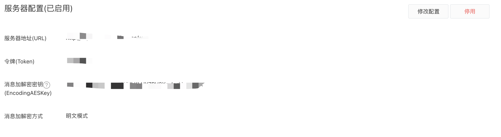

### 2.4实现基本的消息对接，你问我答

粉丝给公众号一条文本消息，公众号立马回复一条文本消息给粉丝，不需要通过公众平台网页操作。

#### 2.4.1 接受文本消息

即粉丝给公众号发送的文本消息。官方wiki链接：[接收普通消息](https://developers.weixin.qq.com/doc/offiaccount/Message_Management/Receiving_standard_messages)

粉丝给公众号发送文本消息：“欢迎开启公众号开发者模式”，在开发者后台，收到公众平台发送的xml 如下：（下文均隐藏了ToUserName 及 FromUserName 信息）

```xml
<xml>
 <ToUserName><![CDATA[公众号]]></ToUserName>
 <FromUserName><![CDATA[粉丝号]]></FromUserName>
 <CreateTime>1460537339</CreateTime>
 <MsgType><![CDATA[text]]></MsgType>
 <Content><![CDATA[欢迎开启公众号开发者模式]]></Content>
 <MsgId>6272960105994287618</MsgId>
</xml>
```

解释：

- createTime 是微信公众平台记录粉丝发送该消息的具体时间
- text: 用于标记该xml 是文本消息，一般用于区别判断
- 欢迎开启公众号开发者模式: 说明该粉丝发给公众号的具体内容是欢迎开启公众号开发者模式
- MsgId: 是公众平台为记录识别该消息的一个标记数值, 微信后台系统自动产生

#### 2.4.2 被动回复给用户文本消息

即公众号给粉丝发送的文本消息，官方wiki链接: [被动回复用户消息](https://developers.weixin.qq.com/doc/offiaccount/Message_Management/Passive_user_reply_message)

特别强调：

1） 被动回复消息，即发送被动响应消息，不同于客服消息接口

2） 它其实并不是一种接口，而是对微信服务器发过来消息的一次回复

3） 收到粉丝消息后不想或者不能5秒内回复时，需回复“success”字符串（下文详细介绍）

4） 客服接口在满足一定条件下随时调用

公众号想回复给粉丝一条文本消息，内容为“test”, 那么开发者发送给公众平台后台的xml 内容如下：

```xml
<xml>
 <ToUserName><![CDATA[粉丝号]]></ToUserName>
 <FromUserName><![CDATA[公众号]]></FromUserName>
 <CreateTime>1460541339</CreateTime>
 <MsgType><![CDATA[text]]></MsgType>
 <Content><![CDATA[test]]></Content>
</xml>
```

特别备注：

1）ToUserName（接受者）、FromUserName(发送者) 字段请实际填写。

2）createtime 只用于标记开发者回复消息的时间，微信后台发送此消息都是不受这个字段约束。

3）text : 用于标记 此次行为是发送文本消息 （当然可以是image/voice等类型）。

4）文本换行 ‘\n’。

**实现流程图**

## 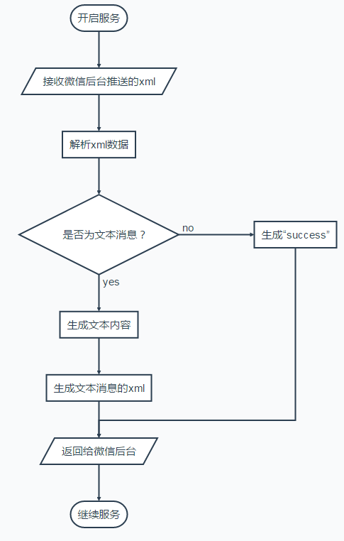

#### 2.4.3 代码实现

main.py文件不改变，handle.py 需要增加一下代码，增加新的文件receive.py, reply.py

**handle.py**

```python
# -*- coding: utf-8 -*-
# filename: handle.py
import web
import hashlib
import receive
import replay


class Handle(object):
    """
    改get请求用于验证Token
    def GET(self):
        try:
            data = web.input()
            print(data)
            if len(data) == 0:
                return "hello, this is handle view"
            signature = data.signature
            timestamp = data.timestamp
            nonce = data.nonce
            echostr = data.echostr
            token = "KarmaLK" #请按照公众平台官网\基本配置中信息填写

            li = [token, timestamp, nonce]
            li.sort()
            tmp_str = "".join(li).encode('utf-8')
            #进行sha1加密
            hashcode = hashlib.sha1(tmp_str).hexdigest()

            #sha1 = hashlib.sha1()
            #map(sha1.update, li)
            #hashcode = sha1.hexdigest()
            print("handle/GET func: hashcode, signature: ", hashcode, signature)
            if hashcode == signature:
                return echostr
            else:
                return ""
        except Exception as Argument:
            return Argument
    """
    def POST(self):
        try:
            webData = web.data()
            print("Handle Post webdata is ", webData.decode('utf-8'))
            #后台打日志
            recMsg = receive.parse_xml(webData)
            # 该模块是处理文本数据信息 
            if isinstance(recMsg, receive.Msg) and recMsg.MsgType == 'text':
                #获取到并解析出来用户发送过来的数据信息
                recContent = recMsg.Content.decode('utf-8')
                print("user message:", recContent,type(recContent))
                # 接受信息与发送信息的主体对象转换一下
                toUser = recMsg.FromUserName
                fromUser = recMsg.ToUserName
                # 定义好需要返回给用户的数据文本内容
                content = recContent
                replyMsg = replay.TextMsg(toUser, fromUser, content)
                return replyMsg.send()
            else:
                print("暂且不处理")
                return "success"
        except Exception as Argment:
            return Argment

```

**receive.py**

```python
# -*- coding: utf-8 -*-#
# filename: receive.py
import xml.etree.ElementTree as ET

 

def parse_xml(web_data):
    if len(web_data) == 0:
        return None
    xmlData = ET.fromstring(web_data)
    msg_type = xmlData.find('MsgType').text
    if msg_type == 'text':
        return TextMsg(xmlData)
    elif msg_type == 'image':
        return ImageMsg(xmlData)


class Msg(object):
    def __init__(self, xmlData):
        self.ToUserName = xmlData.find('ToUserName').text
        self.FromUserName = xmlData.find('FromUserName').text
        self.CreateTime = xmlData.find('CreateTime').text
        self.MsgType = xmlData.find('MsgType').text
        self.MsgId = xmlData.find('MsgId').text
        self.Content = xmlData.find("Content").text


class TextMsg(Msg):
    def __init__(self, xmlData):
        Msg.__init__(self, xmlData)
        self.Content = xmlData.find('Content').text.encode("utf-8")


class ImageMsg(Msg):
    def __init__(self, xmlData):
        Msg.__init__(self, xmlData)
        self.PicUrl = xmlData.find('PicUrl').text
        self.MediaId = xmlData.find('MediaId').text

```

**replay.py**

```python

# -*- coding: utf-8 -*-#
# filename: reply.py
import time

class Msg(object):
    def __init__(self):
        pass

    def send(self):
        return "success"

class TextMsg(Msg):
    def __init__(self, toUserName, fromUserName, content):
        self.__dict = dict()
        self.__dict['ToUserName'] = toUserName
        self.__dict['FromUserName'] = fromUserName
        self.__dict['CreateTime'] = int(time.time())
        self.__dict['Content'] = content

    def send(self):
        XmlForm = """
            <xml>
                <ToUserName><![CDATA[{ToUserName}]]></ToUserName>
                <FromUserName><![CDATA[{FromUserName}]]></FromUserName>
                <CreateTime>{CreateTime}</CreateTime>
                <MsgType><![CDATA[text]]></MsgType>
                <Content><![CDATA[{Content}]]></Content>
            </xml>
            """
        return XmlForm.format(**self.__dict)

class ImageMsg(Msg):
    def __init__(self, toUserName, fromUserName, mediaId):
        self.__dict = dict()
        self.__dict['ToUserName'] = toUserName
        self.__dict['FromUserName'] = fromUserName
        self.__dict['CreateTime'] = int(time.time())
        self.__dict['MediaId'] = mediaId

    def send(self):
        XmlForm = """
            <xml>
                <ToUserName><![CDATA[{ToUserName}]]></ToUserName>
                <FromUserName><![CDATA[{FromUserName}]]></FromUserName>
                <CreateTime>{CreateTime}</CreateTime>
                <MsgType><![CDATA[image]]></MsgType>
                <Image>
                <MediaId><![CDATA[{MediaId}]]></MediaId>
                </Image>
            </xml>
            """
        return XmlForm.format(**self.__dict)

```

完成之后，重新启动服务

```bash
python main.py 80
```

启动后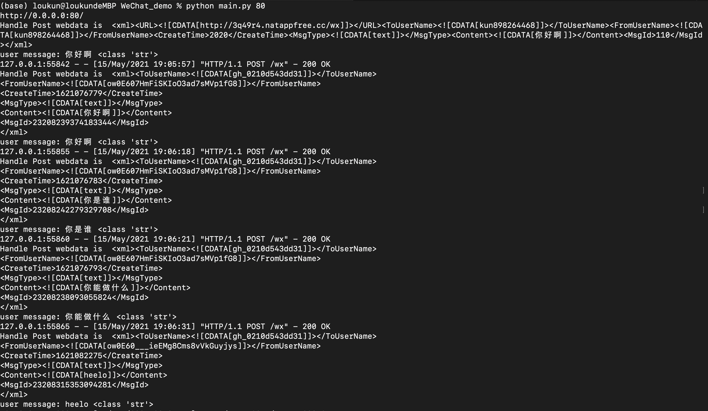

### 2.5 在线接口测试

微信公众平台有提供一个[在线测试的平台](http://mp.weixin.qq.com/debug/)方便开发者模拟场景测试代码逻辑。正如 2.2被动回复文本消息 交代此被动回复接口不同于客服接口，测试时也要注意区别。

在线测试目的在于测试开发者代码逻辑是否有误、是否符合预期。即便测试成功也不会发送内容给粉丝。所以可以随意测试。


检查问题显示请求成功便没有问题

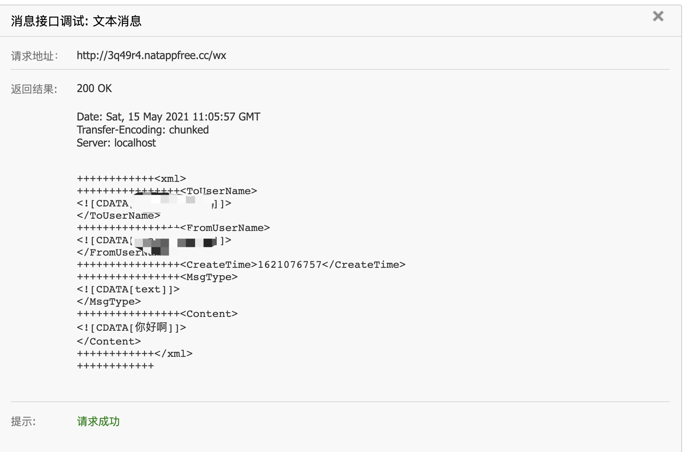

也可以直接在公众号中测试

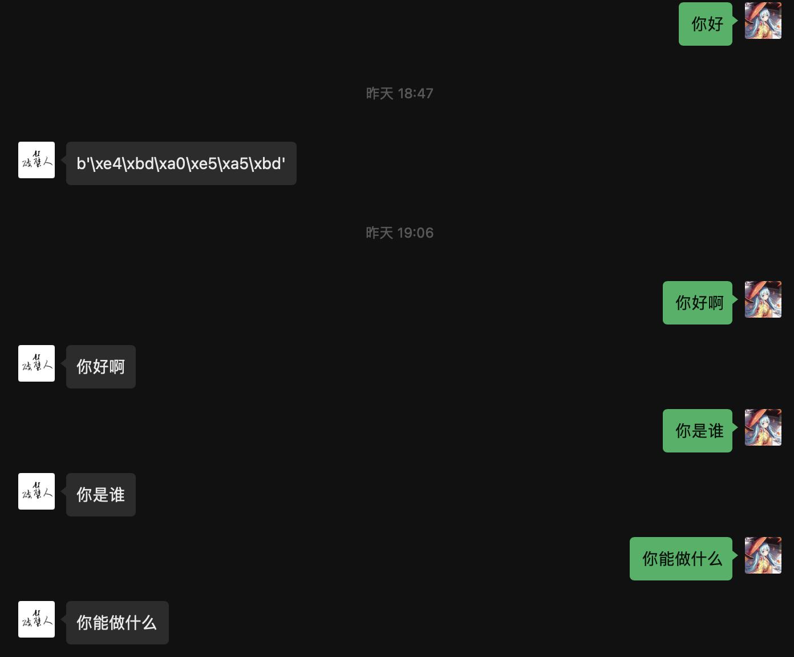


截止到目前，微信公众号对话机器人第一步接口已经打通，后面就是将自己的聊天对话系统对接到改服务中

## 3.对接RASA服务，通过RASA后台起的对话服务作为对话引擎

### 3.1先将RASA服务起来

```bash
$ bash rasa_server.bash
$ bash action_server.bash
```

需要训练的话

```bash
$ bash train.bash
```

服务启动之后，先本地脚本测试一下通信是否没问题

```bash
python test_demo.py
```

如果能正常对话则表示RASA服务没问题

### 3.1 配置Handle.py 中的POST请求

将消息转发到RASA服务中并接受RASA处理后的消息通过Handle返回给用户

```python
botIp = "127.0.0.1" # 本机IP
botPort = '5002'

# 获取rasa的对话回复信息
def get_chat_content(content):
    userid = "xiaokun"
    params = {"sender":userid,"message":content}

    rasaUrl = "http://{0}:{1}/webhooks/rest/webhook".format(botIp, botPort)
    response = requests.post(
        rasaUrl, 
        data = json.dumps(params),
        headers = {'Content-Type':'application/json'}
    )
    return response.text.encode('utf-8').decode("unicode-escape")
```

在Handle中修改POST的请求信息

```python
def POST(self):
    try:
        webData = web.data()
        print("Handle Post webdata is ", webData.decode('utf-8'))
        #后台打日志
        recMsg = receive.parse_xml(webData)
        # 该模块是处理文本数据信息 
        if isinstance(recMsg, receive.Msg) and recMsg.MsgType == 'text':
            #获取到并解析出来用户发送过来的数据信息
            recContent = recMsg.Content.decode('utf-8')
            print("user message:", recContent,type(recContent))
            # 获取RASA服务端得到的返回结果
            result = get_chat_content(recContent)
            result_json = json.loads(result)
            replayContent = ""
            for i in range(len(result_json)):
                bot_utterence = result_json[i]["text"]
                print("Bot:",bot_utterence)
                replayContent += bot_utterence

            print("bot recContent: ", replayContent)
            # 接受信息与发送信息的主体对象转换一下
            toUser = recMsg.FromUserName
            fromUser = recMsg.ToUserName
            # 定义好需要返回给用户的数据文本内容
            replyMsg = replay.TextMsg(toUser, fromUser, replayContent)
            return replyMsg.send()
        else:
            print("暂且不处理")
            return "success"
    except Exception as Argment:
        return Argment
```

修改完成后重新启动程序

```bash
python main.py 80
```

之后进入到公众号中就可以进行对话了，

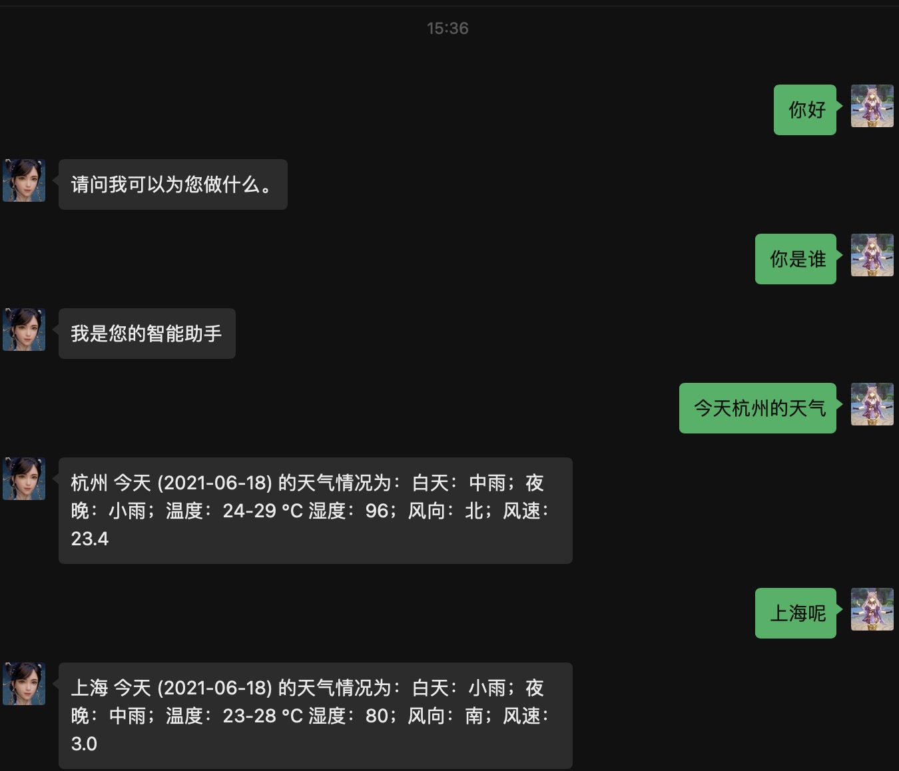

目前的配置暂时还不能处理图片消息，以及配置公众号的菜单栏(微信公共号启用服务器配置会与自定义菜单栏冲突，如果想要两个功能都存在，则需要自己通过代码配置菜单栏，这在[开启公众号开发着模式入门指引文档](https://developers.weixin.qq.com/doc/offiaccount/Getting_Started/Getting_Started_Guide.html)中有详细教程)。之后有时间回尝试将菜单栏的功能也添加进去，并加入图片消息的支持


## 总结

微信公众号聊天机器人对接RASA其实是两个独立模块通过http请求将消息进行转发来实现的，RASA这边搭建好对话机器人后由于其本身就支持RPC远程服务调用，所以通过本地服务器接收到用户的小时后直接转发费RASA后台进行处理反馈并将反馈的回复再发送给用户，中间感觉好像是https请求有些多，可能消息接受回复的时延回比较高，针对RASA对接微信聊天机器人应该还会有其他更高效率的实现方式，这只是一个简单的尝试。

另外，RASA项目这块主要是参考[Dustyposa](https://github.com/Dustyposa/rasa_ch_faq/commits?author=Dustyposa)的项目，这位大佬实现的前端挺不错的，如果没有微信公众号部署的需求的话，直接采用他的这个前端项目实现就挺不错的。

## 后期规划

针对RASA聊天机器人上考虑再扩展一些功能，比如加上医疗知识图谱问答，闲聊等，想做一个通用型的聊天机器人

